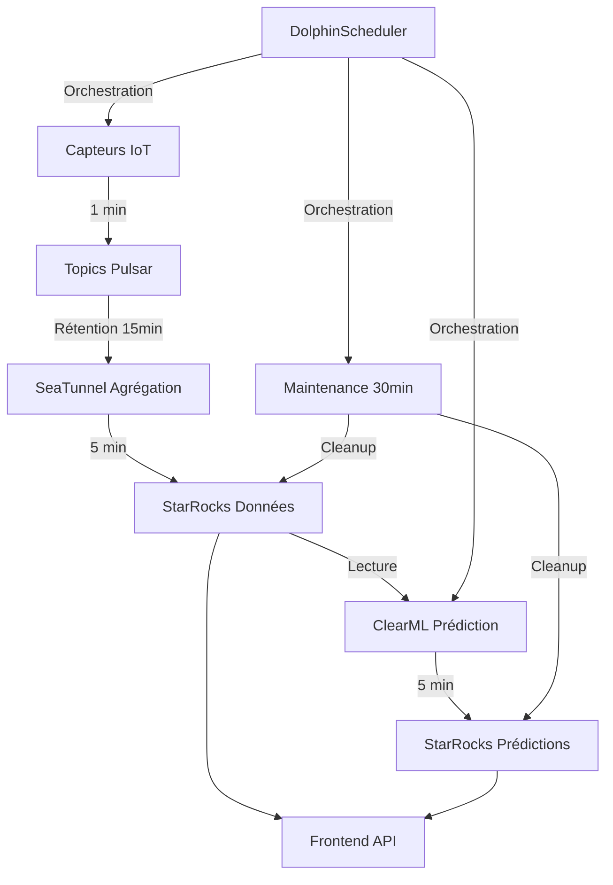

# CIAPOL - Centre Ivoirien Anti-Pollution
## Système de Surveillance de la Qualité de l'Air en Temps Réel avec Prédictions IA


---

## 🌍 Vue d'Ensemble

CIAPOL est une plateforme complète de surveillance de la qualité de l'air pour la Côte d'Ivoire, intégrant l'intelligence artificielle pour des prédictions en temps réel. Le système combine collecte de données IoT, traitement en temps réel, et prédictions ML pour fournir une surveillance environnementale avancée.

## 🏗️ Architecture du Pipeline Complet



### 📊 Flux de Données Temps Réel

1. **Génération IoT** (1 minute) : Capteurs → Topics Pulsar
2. **Rétention Pulsar** (15 minutes) : Auto-suppression données anciennes
3. **Agrégation** (5 minutes) : SeaTunnel → Moyennes arithmétiques → StarRocks
4. **Prédiction IA** (5 minutes) : ClearML → Modèles ML → Prédictions 5min futures
5. **Maintenance** (30 minutes) : Nettoyage automatique StarRocks (rétention 48h)
6. **Frontend** : Dashboard temps réel via APIs StarRocks

## 🎯 Fonctionnalités Principales

### 📈 Surveillance Temps Réel
- **Données météorologiques** : Température, humidité, pression, vent, précipitations
- **Polluants atmosphériques** : PM2.5, PM10, NO₂, O₃, CO, SO₂
- **Indices AQI** : Calcul automatique avec codes couleur et niveaux
- **Alertes critiques** : Détection automatique dépassements de seuils

### 🔮 Prédictions Intelligence Artificielle
- **Modèles ClearML** : Prédictions météo et qualité de l'air
- **Horizon 5 minutes** : Prévisions à court terme haute précision
- **Scores de confiance** : Évaluation fiabilité des prédictions
- **Mise à jour continue** : Ré-entraînement automatique des modèles

### 🖥️ Interface Utilisateur Avancée
- **Dashboard prédictif** : Données actuelles + prédictions futures
- **Cartes interactives** : Visualisation géospatiale temps réel
- **Graphiques temporels** : Évolution historique et tendances
- **Rapports automatiques** : Génération PDF et exports de données

### 🔧 Maintenance Automatique
- **Rétention Pulsar** : Suppression automatique > 15 minutes
- **Rétention StarRocks** : Nettoyage automatique > 48 heures
- **Logs de maintenance** : Traçabilité complète des opérations
- **Monitoring système** : Surveillance performance et santé

## 🛠️ Stack Technologique

### 🏢 Backend & Infrastructure
- **Apache Pulsar** : Streaming temps réel (rétention 15min)
- **StarRocks** : Base de données analytique OLAP (rétention 48h)
- **SeaTunnel** : Moteur ETL pour agrégation (fenêtres 5min)
- **DolphinScheduler** : Orchestrateur workflows (3 jobs automatiques)
- **ClearML** : Plateforme MLOps pour prédictions IA

### 🌐 Frontend & APIs
- **Next.js 14** : Framework React avec App Router
- **TypeScript** : Développement type-safe
- **Tailwind CSS** : Styling moderne et responsive
- **Leaflet** : Cartes interactives
- **Chart.js** : Visualisations de données

### 🐳 Déploiement & DevOps
- **Docker Compose** : Orchestration multi-services
- **MySQL Protocol** : Connexion StarRocks depuis APIs
- **REST APIs** : Endpoints optimisés pour frontend
- **Health Checks** : Monitoring santé des services

## 🚀 Installation et Déploiement

### Prérequis
- Docker & Docker Compose
- Python 3.8+
- Node.js 18+
- 8GB RAM minimum
- 50GB espace disque

### 🔧 Déploiement Automatique

```bash
# Cloner le repository
git clone <repository-url>
cd ikna_ciapol

# Déployer le pipeline complet
chmod +x scripts/deploy-aggregation-pipeline.sh
./scripts/deploy-aggregation-pipeline.sh
```

Le script automatique configure :
- ✅ Services Docker (Pulsar, StarRocks, DolphinScheduler, SeaTunnel)
- ✅ Topics Pulsar avec rétention 15 minutes
- ✅ Schémas StarRocks avec tables agrégées et prédictions
- ✅ Configurations SeaTunnel pour agrégation et maintenance
- ✅ Workflows DolphinScheduler (génération, prédiction, nettoyage)
- ✅ Frontend avec APIs StarRocks

### 📊 Vérification du Déploiement

```bash
# Tester le pipeline complet
python3 scripts/test-aggregation-pipeline.py

# Vérifier la santé des services
curl http://localhost:3000/api/health    # Frontend
curl http://localhost:8080/admin/v2/     # Pulsar
curl http://localhost:8030/api/health    # StarRocks
curl http://localhost:12345/             # DolphinScheduler
```

## 🌐 Accès aux Services

| Service | URL | Description |
|---------|-----|-------------|
| **Frontend CIAPOL** | http://localhost:3000 | Interface utilisateur principale |
| **Dashboard Prédictif** | http://localhost:3000/dashboard | Données temps réel + prédictions |
| **Pulsar Admin** | http://localhost:8080 | Administration topics streaming |
| **StarRocks FE** | http://localhost:8030 | Base de données analytique |
| **DolphinScheduler** | http://localhost:12345 | Orchestrateur workflows |

## 📊 APIs Disponibles

### Données Agrégées
```http
GET /api/data/aggregated?type=sensor&stationId=ABIDJAN_01&hoursBack=24
GET /api/data/aggregated?type=pollutant&limit=100
GET /api/data/aggregated?type=aqi&stationId=all
```

### Prédictions ClearML
```http
GET /api/data/predictions?stationId=ABIDJAN_01&hoursAhead=12
GET /api/data/predictions?includeConfidence=true&limit=50
POST /api/data/predictions (bulk stations)
```

## 🔍 Monitoring et Maintenance

### 📈 Métriques Clés
- **Latence prédictions** : < 30 secondes
- **Précision modèles** : Score de confiance > 70%
- **Disponibilité** : > 99.5% uptime
- **Rétention données** : Pulsar 15min, StarRocks 48h

### 🛠️ Maintenance Automatique
- **Nettoyage Pulsar** : Automatique (TTL 15 minutes)
- **Nettoyage StarRocks** : SeaTunnel job toutes les 30 minutes
- **Logs système** : Rétention 7 jours avec rotation automatique
- **Prédictions ML** : Mise à jour modèles toutes les 5 minutes

## 📁 Structure du Projet

```
ikna_ciapol/
├── frontend/                     # Interface Next.js
│   ├── src/app/                  # Pages et APIs
│   ├── src/components/           # Composants React
│   └── src/app/dashboard/        # Dashboard prédictif
├── services/
│   ├── pulsar/                   # Configuration topics
│   ├── starrocks/               # Schémas et tables
│   ├── seatunnel/               # Jobs ETL et nettoyage
│   ├── dolphinscheduler/        # Workflows orchestration
│   ├── clearml-prediction/      # Service prédictions IA
│   └── sensor-simulator/        # Générateur données
├── scripts/
│   ├── deploy-aggregation-pipeline.sh  # Déploiement complet
│   ├── configure-pulsar-retention.sh   # Configuration rétention
│   └── test-aggregation-pipeline.py    # Tests validation
└── docker-compose.yml           # Orchestration services
```

## 🤝 Contribution

1. Fork le repository
2. Créer une branch feature (`git checkout -b feature/nouvelle-fonctionnalite`)
3. Commit les changements (`git commit -am 'Ajout nouvelle fonctionnalité'`)
4. Push la branch (`git push origin feature/nouvelle-fonctionnalite`)
5. Créer une Pull Request

## 📄 Licence

Ce projet est sous licence MIT. Voir le fichier `LICENSE` pour plus de détails.

## 📞 Support

- **Documentation** : [Wiki du projet](./docs/)
- **Issues** : [GitHub Issues](./issues)
- **Email** : support@ciapol.ci

---

### 🌟 CIAPOL v2.0 - Surveillance Intelligente de la Qualité de l'Air

**Architecture Production** : Génération 1min → Pulsar 15min → Agrégation 5min → Prédiction IA 5min → StarRocks 48h → Frontend Temps Réel

*Développé pour le Centre Ivoirien Anti-Pollution - Côte d'Ivoire* 🇨🇮